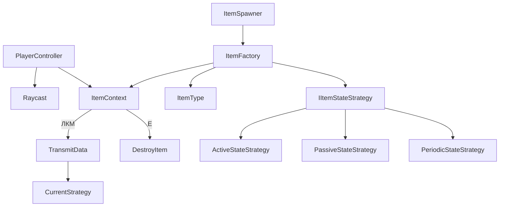
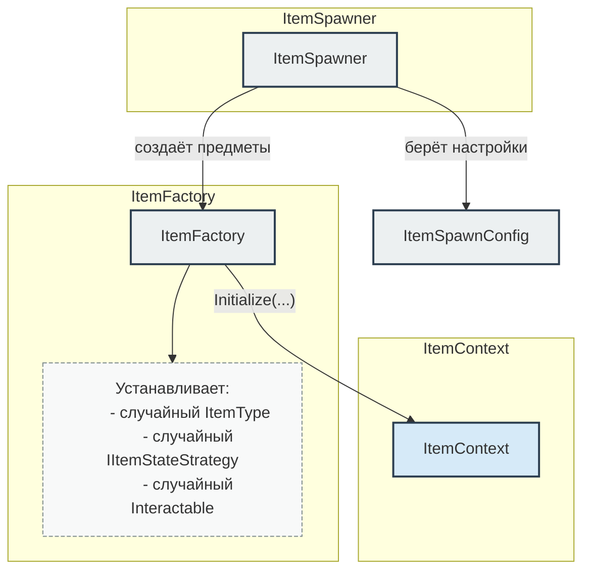
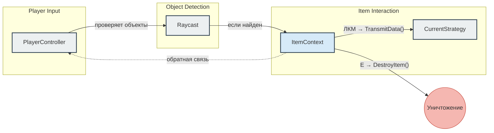
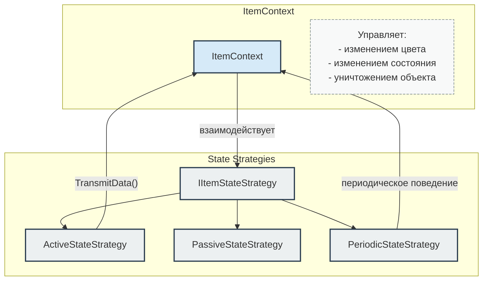

Дипломная работа - Разработка комплекса цифровых двойников ST-500 "Пиранья" и многофункционального бинокля ОБЛИК-2

## Общая схема взаимодействия

### ItemSpawner and ItemFactory

### Детальное взаимодействие с PlayerController

### Взаимодействие стратегий состояния

